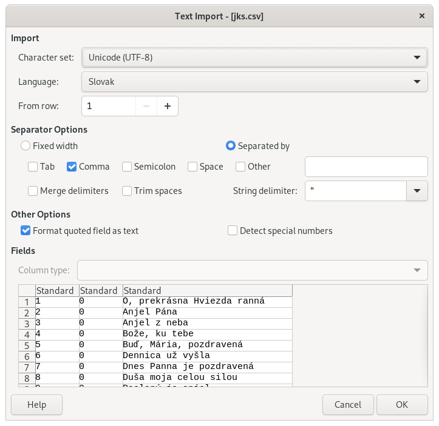

# Jednotný katolícky spevník

## Databázová štruktúra

### Tabuľka `jks`

| Číslo piesne | Poradové číslo strofy | Text strofy                                                                                                                                                                                                                   |
| ------------ | --------------------- | ----------------------------------------------------------------------------------------------------------------------------------------------------------------------------------------------------------------------------- |
| 247          | 0                     | Ó, Ježišu náš najmilší                                                                                                                                                                                                        |
| 247          | 1                     | Ó, Ježišu náš najmilší, - k obete sa schádzame, - ktorú tebe v čas terajší - skrze kňaza konáme. - Prijmi teda do milosti - vďačnú službu tu od nás, - aby s nami vo večnosti - tešili sa svätí z nás.                        |
| 247          | 2                     | Tak je, buď vždy Bohu chvála, - jeho česť vždy hľadajme, - nech ho všetci ľudia chvália, - vrúcnym srdcom žiadajme, - lebo Otcom všetkých je nás, - ktorý nás tak miloval, - že i Syna svojho za nás - na smrť dať neľutoval. |
| 247          | ...                   | ...                                                                                                                                                                                                                           |

> Strofa s poradovým čislom `0` je nadpis piesne.

## Pridať alebo upraviť pieseň

1. stiahnite si [CSV súbor](db/jks.csv) s databázou piesní pre tabuľku `jks`
1. otvorte súbor napr. v programe [LibreOffice](https://www.libreoffice.org/download/download/)
1. zachovajte formát súboru, v prípade LibreOffice zvoľte nastavenia:

   

### Nová pieseň

1. do CSV súboru pridajte toľko riadkov, koľko má zadávaná pieseň strof a prípočítajte jeden riadok pre nadpis
1. ako je uvedené v _databázovej štruktúre_ pridajte:
   1. riadok pre nadpis s číslom piesne v prvom stĺpci, poradovým čislom `0` v druhom a jej nadpisom v treťom stĺpci
   1. do ďalšieho riadku opäť to isté číslo piesne do prvého stĺpca, poradové čislo strofy (napr. `1`) do druhého a text celej strofy do tretieho
   1. pokračujte týmto spôsobom, kým nie sú zapísané všetky strofy piesne

### Existujúca pieseň

1. v CSV súbore vyhľadajte pieseň, ktorú chcete upraviť
1. upravte text strofy v treťom stĺpci, ako je uvedené v _databázovej štruktúre_ vyššie
1. v prípade, že chcete rozšíriť pieseň o ďalšiu strofu, postupujte podľa postupu, ako zadať novú pieseň - bod _2.2_

## Zápis do GitHub

- všetky zmeny vykonávajte vo vlastnej vývojovej vetve alebo projekte
- vytvorte **pull request** cez GitHub na zapracovanie zmien do **master** vetvy

> Ak máte problém so zápisom do GitHub, môžete mi Vami upravený CSV súbor poslať na môj _stanislav.bebej_ email v službe gmail.com.
